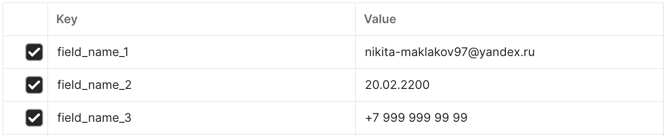
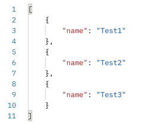
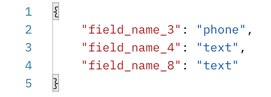
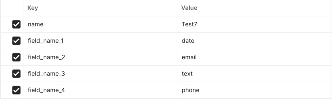
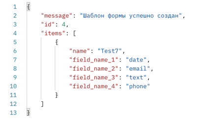

# Идентификация шаблона формы по входным параметрам

## Описание проекта
Необходимо разработать приложение, которое позволит идентифицировать шаблон формы по входным параметрам.

В БД хранится список шаблонов форм в формате:
```json
{
  "name": "Test",
  "field_name_1": "email",
  "field_name_2": "phone",
  "field_name_3": "text"
}
```
Поддерживается 4 типа данных полей - email, телефон, дата, текст.
Все типы кроме текста должны поддерживать валидацию:
1. Телефон. Маска - +7 999 999 99 99;
2. Дата. Формат DD.MM.YYYY или YYYY-MM-DD;
3. Email. Маска - 1@2.3 .
Имя шаблона формы и полей задаются в свободной форме.

Пример запроса:

URL: /get_form

Тип запроса: POST

Формат запроса: 
f_name1=value1&f_name2=value2

В ответ необходимо вернуть имя шаблона формы, если была найдена.
Если подходящей формы не нашлось, необходимо вернуть ответ в формате:
Наименование поля - Тип поля
```json
{
  "field_name_1": "FIELD_TYPE",
  "field_name_2": "FIELD_TYPE"
}
```
где FIELD_TYPE - тип поля, определенный по правилам валидации.
Проверка правил производится в порядке date - phone - email - text.

В случае, если полей во входных данных пришло больше, чем в шаблоне, то шаблон будет считаться подходящим. Главное, чтобы поля шаблона присутствовали во входных параметрах.

Также необходимо создать скрипт , который совершает тестовые запросы.

## Структура проекта
Проект имеет следующую файловую структуру:
```text
├── main.py                                 # Файл инициализации приложения
├── database.json                           # База данных, содержащая структуру шаблонов форм
├── requirements.txt                        # Зависимости проекта
├── .gitignore                              # Конфигурационный файл для исключения лишних файлов для Git
└── app/                                    # Директория c логикой проекта  
    ├── api/                                # Роутеры
        ├── v1/                             # Управление версиями API
            ├── CreateFormTemplateRouter.py # Роутер для создания шаблонов форм
            ├── FormValidationRouter.py     # Роутер для идентификации шаблона формы по входным параметрам
    ├── db/                                 # Директория конфигурации базы данных
        ├── config.py                       # Конфигурационный файл базы данных
    ├── schemas/                            # Директория валидационных схем
        ├── ValidationSchema.py             # Валидационная схема
└── test/                                   # Директория со скриптами для теста приложения
        ├── script_request.py               # Скрипт для тестирования
└── docs/                                   # Директория с документацией к проекту
    ├── README.MD                           # Информация о проекте
    ├── images/                             # Директория с рисунками для документации
        ├── img.png                         # Рисунок 1        
        ├── img_1.png                       # Рисунок 2        
        ├── img_2.png                       # Рисунок 3        
        ├── img_3.png                       # Рисунок 4        
        ├── img_4.png                       # Рисунок 5        
```

## API-маршруты
### Получение формы валидации
URL: /get_form

Метод: POST

Content-Type: x-www-form-urlencoded

Формат входных параметров:



Формат выходных параметров:




### Создание шаблона формы валидации
URL: /create_form

Метод: POST

Content-Type: x-www-form-urlencoded

Формат входных параметров:



Формат выходных параметров:



## Разработка
### Требования
Для установки и запуска проекта необходимо Python версии 3.11.

### Клонирование репозитория
```text
git clone https://github.com/avilovn/identification_template_form.git
```

### Создание виртуального окружения
Windows:
```text
python -m venv <PATH>

cmd.exe
<PATH>\Scripts\activate.bat
PowerShell
<PATH>\Scripts\Activate.ps1
```
Linux/macOS:
```text
python3 -m venv <PATH>
source <PATH>/bin/activate
```

### Установка зависимостей
```text
pip install -r requirements.txt
```
### Запуск
Для запуска проекта необходимо в основной директории в терминале ввести:
```text
uvicorn main:app --reload
```
## Тестирование
Для запуска скрипта необходимо из основной директории зайти в директорию test и ввести следующую команду в терминале:

Windows:
```text
python script_request.py
```
Linux/macOS:
```text
python3 script_request.py
```

